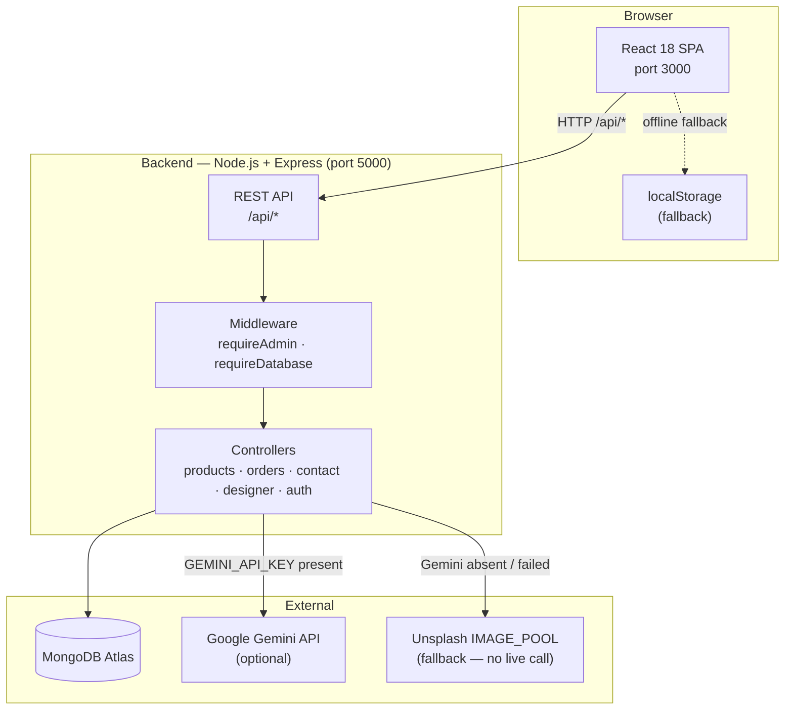
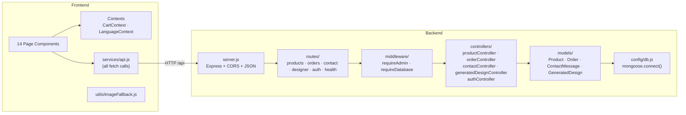
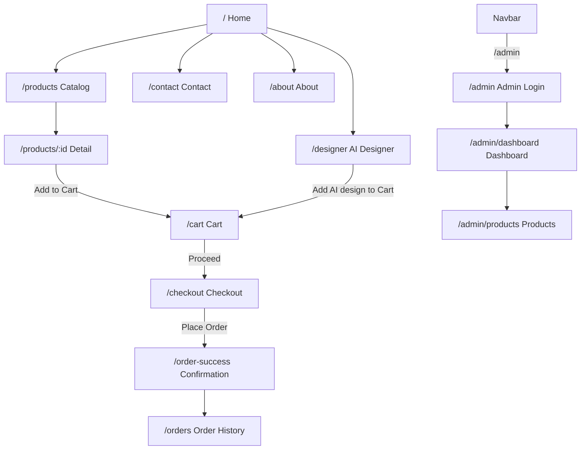
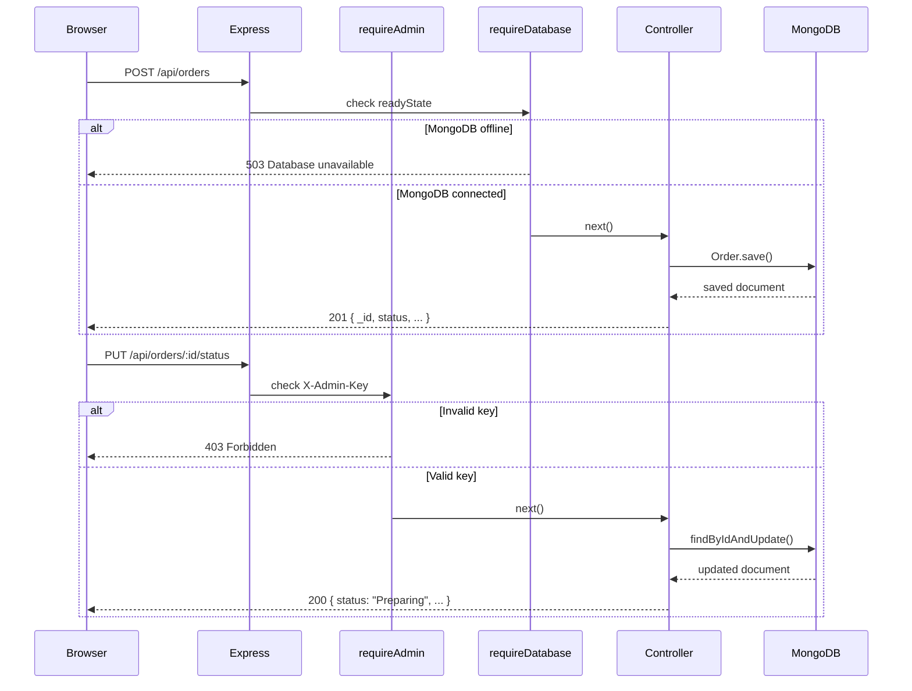
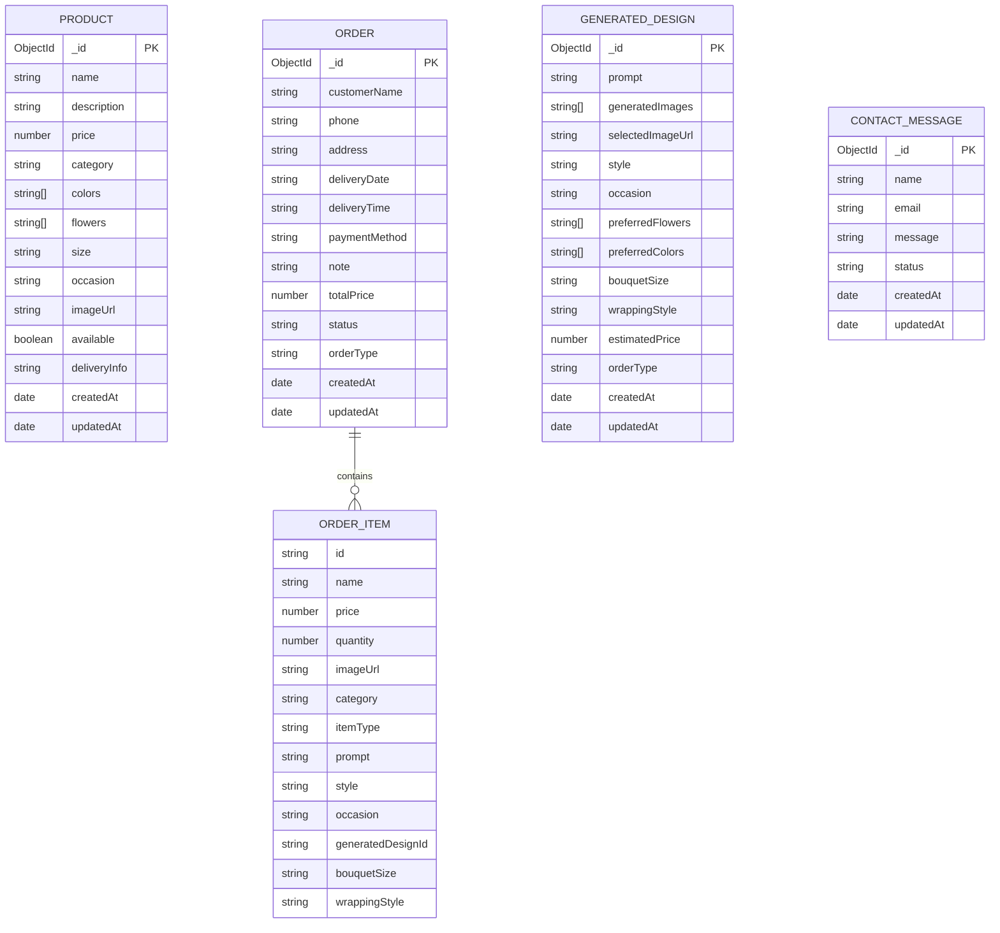
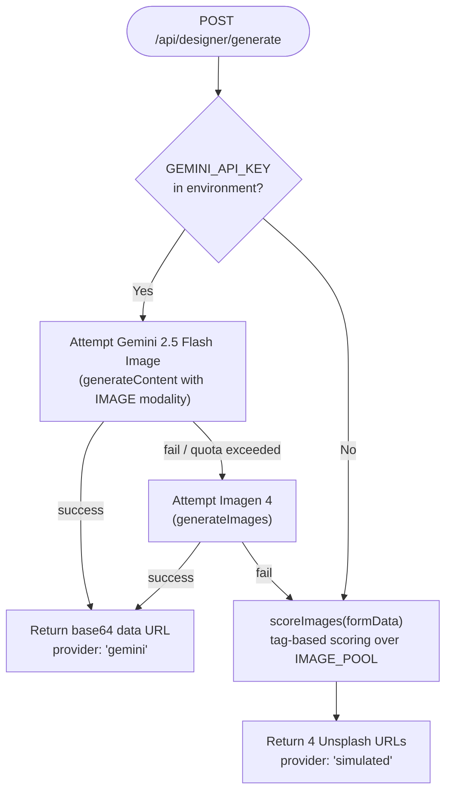

# FloraDesigner — Technical Report

---

**Project name:** FloraDesigner  
**Project type:** Full-stack AI-assisted floral e-commerce platform  
**Student:** Goga Chiqovani  
**Email:** goga.chiqovani.st@gmail.com  
**Repository:** https://github.com/chiqqo/FloraDesigner  
**Date:** June 2026  

---

## Table of Contents

1. [Abstract](#abstract)
2. [Introduction](#introduction)
3. [Problem Statement](#problem-statement)
4. [Project Objectives](#project-objectives)
5. [System Overview](#system-overview)
6. [Main Features](#main-features)
7. [Technology Stack](#technology-stack)
8. [System Architecture](#system-architecture)
9. [Frontend Architecture](#frontend-architecture)
10. [Backend Architecture](#backend-architecture)
11. [Database Design](#database-design)
12. [API Design](#api-design)
13. [Authentication and Authorization](#authentication-and-authorization)
14. [AI Designer and Gemini / Fallback Strategy](#ai-designer-and-gemini--fallback-strategy)
15. [Localization and Currency Support](#localization-and-currency-support)
16. [Error Handling and Fallback Behavior](#error-handling-and-fallback-behavior)
17. [Testing and Verification](#testing-and-verification)
18. [Security Considerations](#security-considerations)
19. [Limitations](#limitations)
20. [Future Improvements](#future-improvements)
21. [Conclusion](#conclusion)

---

## Abstract

FloraDesigner is a full-stack web application developed as a bachelor graduation project. It implements a complete e-commerce platform for an online flower shop, combining a curated product catalog with an AI-assisted custom bouquet designer. The system is built with React 18 on the frontend and Node.js + Express on the backend, with MongoDB as the primary data store.

The platform supports bilingual operation in Georgian and English, stores all prices in Georgian Lari (GEL), and integrates with the Google Gemini API for optional AI image generation. When Gemini is unavailable, the application falls back seamlessly to a curated pool of scored Unsplash bouquet images selected by a tag-matching algorithm. All features degrade gracefully to browser `localStorage` when the backend server is offline, ensuring the application remains fully demonstrable in any environment.

The project demonstrates end-to-end software engineering practices: RESTful API design, Mongoose schema modeling, React Context-based state management, internationalization without a third-party i18n library, role-based route protection, a custom smoke test suite, and a CI-ready production build pipeline.

---

## Introduction

Online retail for perishable goods such as flowers presents unique challenges: customers need confidence in product quality and availability, they benefit from personalization tools that go beyond a fixed catalog, and the purchasing flow must be friction-free on both desktop and mobile browsers. For a Georgian audience, the interface must operate in Georgian by default while remaining accessible in English for international visitors.

FloraDesigner addresses these challenges by providing two complementary shopping paths: a filtered catalog of twelve hand-curated bouquets, and an AI-assisted designer that lets customers specify occasion, flowers, colors, style, size, and wrapping before receiving a generated design concept and price estimate. The entire flow — from browsing to checkout to order history — is implemented as a single-page application with server-side persistence and client-side fallback.

This report documents the technical design decisions, architecture, implementation details, and evaluation of the project.

---

## Problem Statement

Existing flower shop websites in Georgia typically offer a static catalog of fixed products with limited filtering. Customers who have a specific occasion in mind — a wedding, a graduation, or a sympathy arrangement — cannot easily communicate their preferences within the confines of a predefined catalog. Custom orders require telephone calls or in-person visits, which creates friction and excludes customers who prefer to shop digitally.

Additionally, many local e-commerce implementations lack bilingual support, leaving English-speaking residents or tourists without a native-language experience. Price display conventions also differ: Georgian customers expect the Lari symbol (₾) directly before the amount, while English-language conventions typically append the currency code after the number.

FloraDesigner was built to solve these problems by:

- Providing a filterable catalog with rich metadata (flowers, colors, size, occasion, availability).
- Offering an AI designer that accepts free-form preferences and returns a design concept with an estimated price.
- Delivering a fully bilingual Georgian/English interface with locale-appropriate price formatting.
- Maintaining a complete order lifecycle with admin management tools.

---

## Project Objectives

| # | Objective | Status |
|---|---|---|
| 1 | Build a full-stack web application demonstrating all CRUD operations | Achieved |
| 2 | Integrate a real external AI API (Google Gemini) for image generation | Achieved |
| 3 | Implement graceful offline fallback for all data-dependent features | Achieved |
| 4 | Deliver a bilingual Georgian/English UI with locale-appropriate currency formatting | Achieved |
| 5 | Implement role-based access control for admin operations | Achieved |
| 6 | Build an automated smoke test suite for the backend API | Achieved |
| 7 | Produce a clean, zero-warning production build | Achieved |
| 8 | Seed and maintain a consistent 12-product demo catalog | Achieved |

---

## System Overview

FloraDesigner consists of three logical tiers:

1. **Frontend** — A React 18 single-page application served by a Vite dev server on port 3000 (development) or as static files (production build). It communicates with the backend exclusively through the `/api` prefix, which Vite proxies to `http://localhost:5000` in development.

2. **Backend** — A Node.js + Express REST API on port 5000. It connects to MongoDB Atlas, handles all business logic, proxies Gemini API calls, and enforces admin-only route protection.

3. **Database** — MongoDB Atlas (cloud) with four collections: `products`, `orders`, `contactmessages`, and `generateddesigns`.



---

## Main Features

### Customer-facing

| Feature | Description |
|---|---|
| Bilingual UI | Georgian (default) and English. Toggle persists in `localStorage`. |
| Product catalog | 12 curated bouquets. Search, 7 filters (category, color, flower, size, occasion, price range, in-stock). |
| Product detail pages | High-resolution image, Georgian description, metadata badges, quantity selector, Add to Cart. |
| Shopping cart | Add, remove, adjust quantity. Per-item and total price. Persists via `localStorage`. |
| Checkout | Delivery form with date/time slot, three simulated payment methods, florist note field. |
| Order confirmation | Full order summary, backend persistence indicator. |
| Order history | All orders merged from backend + `localStorage`, filterable by type and status, expandable detail panels. |
| AI Bouquet Designer | Select occasion, style, size, wrapping, preferred flowers, preferred colors, free-text description. Returns 4 images with an estimated price. |
| Contact form | Saves to MongoDB; falls back to `localStorage`. |

### Admin

| Feature | Description |
|---|---|
| Admin login | Credentials validated server-side; token stored in `sessionStorage`. |
| Dashboard | Summary stats (products, orders, revenue, AI designs). Order list with status update. Contact messages. |
| Product management | Full CRUD — add, edit, delete, availability toggle. |

---

## Technology Stack

| Layer | Technology | Version |
|---|---|---|
| Frontend framework | React | 18 |
| Build tool | Vite | 5 |
| CSS framework | Tailwind CSS | 3 |
| Routing | React Router | v6 |
| State management | React Context API | — |
| Backend framework | Node.js + Express | 18 / 4 |
| ODM | Mongoose | 8 |
| Database | MongoDB Atlas | — |
| AI image generation | Google Gemini API (`@google/genai`) | 0.x |
| Environment config | dotenv | — |
| Hot reload (dev) | nodemon | — |
| Package management | npm | — |
| Version control | Git + GitHub | — |

No Redux, no external i18n library, no payment gateway, no customer auth system. All state is handled by React Context or `localStorage`.

---

## System Architecture

### High-level component diagram



### Request lifecycle

Every HTTP request from the browser:
1. Arrives at the Vite proxy (`/api/*` → `localhost:5000`) in development.
2. Passes through Express JSON parsing and CORS middleware.
3. Reaches the matching route handler.
4. If admin-protected: `requireAdmin` validates the `X-Admin-Key` header.
5. If database-dependent: `requireDatabase` checks Mongoose `readyState`.
6. The controller executes business logic, queries MongoDB, and returns a JSON response.

---

## Frontend Architecture

### Directory structure

```
frontend/src/
├── context/
│   ├── CartContext.jsx        — cart items array, add/remove/update, total calculation
│   └── LanguageContext.jsx    — translations object, t() helper, formatCurrency(), language toggle
├── pages/                     — 14 page components (one per route)
├── components/
│   ├── Navbar.jsx             — language toggle, cart icon, navigation links
│   └── Layout.jsx             — wraps all pages with Navbar + max-width container
├── data/
│   └── products.js            — 12 hardcoded mock products (offline fallback)
├── services/
│   └── api.js                 — all fetch() calls; every function has try/catch
└── utils/
    └── imageFallback.js       — onError handler for broken product images
```

### Routing

React Router v6 with `<BrowserRouter>`. All routes are defined in `App.jsx`:

| Path | Component |
|---|---|
| `/` | `Home` |
| `/products` | `Products` |
| `/products/:id` | `ProductDetails` |
| `/cart` | `Cart` |
| `/checkout` | `Checkout` |
| `/order-success` | `OrderSuccess` |
| `/orders` | `OrderHistory` |
| `/designer` | `AIDesigner` |
| `/contact` | `Contact` |
| `/about` | `About` |
| `/admin` | `AdminLogin` |
| `/admin/dashboard` | `AdminDashboard` |
| `/admin/products` | `AdminProducts` |
| `*` | `NotFound` |

### State management

Two React Contexts are created in `main.jsx` and wrap the entire application:

- **`CartContext`** — holds `cartItems`, exposes `addToCart`, `removeFromCart`, `updateQuantity`, `clearCart`, and a computed `cartTotal`.
- **`LanguageContext`** — holds the current `language` (`'ka'` or `'en'`), the `t(key, vars)` translation function (supports `{variable}` interpolation), `formatCurrency(amount)`, and `toggleLanguage`. Language persists in `localStorage` under key `'floradesigner_language'`. Default is `'ka'` (Georgian).

### User flow diagram



---

## Backend Architecture

### Entry point

`server.js` bootstraps the Express app: applies CORS (origin from `CLIENT_ORIGIN` env), enables `express.json()`, calls `connectDB()` (non-blocking — the app serves requests even if MongoDB is still connecting), and mounts the router at `/api`.

### Middleware

| Middleware | File | Purpose |
|---|---|---|
| `requireDatabase` | `middleware/requireDatabase.js` | Returns `503` if `mongoose.connection.readyState !== 1`. Prevents controllers from executing DB calls when Atlas is unreachable. |
| `requireAdmin` | `middleware/requireAdmin.js` | Checks `X-Admin-Key` header against `process.env.ADMIN_API_KEY`. Returns `403` if missing or mismatched. |

### Backend API flow



---

## Database Design

All Mongoose schemas use `timestamps: true`, adding `createdAt` and `updatedAt` automatically.

### Entity relationship diagram



`ORDER_ITEM` is an embedded subdocument within `ORDER` (no separate collection). `PRODUCT` and `ORDER` are independent — the order snapshot duplicates item data at checkout time to remain consistent even if the product is later edited or deleted.

---

## API Design

The API follows RESTful conventions. All responses are JSON. Error responses always include a `message` field.

### Route summary

| Method | Route | Auth | Description |
|---|---|---|---|
| GET | `/api/health` | Public | Server + database connectivity check |
| GET | `/api/products` | Public | All products, newest first |
| GET | `/api/products/:id` | Public | Single product by `_id` |
| POST | `/api/products` | Admin | Create product |
| PUT | `/api/products/:id` | Admin | Update product |
| DELETE | `/api/products/:id` | Admin | Delete product |
| GET | `/api/orders` | Public | All orders, newest first |
| GET | `/api/orders/:id` | Public | Single order by `_id` |
| POST | `/api/orders` | Public | Place order |
| PUT | `/api/orders/:id/status` | Admin | Update order status |
| POST | `/api/contact` | Public | Submit contact message |
| GET | `/api/contact` | Admin | Read all contact messages |
| POST | `/api/auth/admin/login` | Public | Validate credentials, return token |
| POST | `/api/designer/generate` | Public | Generate AI bouquet (Gemini or fallback) |
| POST | `/api/designer/save` | Public | Save selected design to DB |
| GET | `/api/designer/designs` | Public | List all saved designs |
| GET | `/api/designer/designs/:id` | Public | Single saved design |

### Price estimation formula (AI Designer)

```
BASE = { Small: 65, Medium: 95, Large: 130, Extra Large: 160 }
MULT = { Luxury: 1.2, Romantic: 1.1, Classic: 1.05, default: 1.0 }
estimatedPrice = round(BASE[size] * MULT[style])
```

---

## Authentication and Authorization

FloraDesigner implements demo-level token-based authentication appropriate for a bachelor graduation project.

**Login flow:**

1. Admin submits `POST /api/auth/admin/login` with `{ username, password }`.
2. The backend compares the submitted values against `ADMIN_USERNAME` and `ADMIN_PASSWORD` environment variables (plain-text comparison — no bcrypt).
3. On success, the backend returns `{ token: ADMIN_API_KEY }`.
4. The frontend stores the token in `sessionStorage` under key `'floradesigner_admin_key'`.
5. All subsequent admin requests include the header `X-Admin-Key: <token>`.
6. The `requireAdmin` middleware validates the header on every protected route.

**Scope of protection:**
- `POST /api/products` — create product
- `PUT /api/products/:id` — update product
- `DELETE /api/products/:id` — delete product
- `PUT /api/orders/:id/status` — update order status
- `GET /api/contact` — read contact messages
- `GET /api/designer` — list AI designs (admin view)

The `GEMINI_API_KEY` is held exclusively in `backend/.env` and is never sent to the browser.

---

## AI Designer and Gemini / Fallback Strategy

### Overview

The AI Designer page (`/designer`) collects user preferences via bilingual chip selectors and an optional free-text description field, then calls `POST /api/designer/generate`.

The backend controller (`generatedDesignController.js`) follows this decision chain:



### Tag-based image scoring

When Gemini is unavailable, the fallback selects images from a pool of 8 curated Unsplash URLs. Each pool entry carries a list of English and Georgian keyword tags. The `scoreImages()` function:

1. Concatenates all form fields (occasion, style, size, wrapping, flowers, colors, description) into a single lowercase string.
2. For each pool image, counts how many of its tags appear as substrings in the input string.
3. Sorts images by score descending. Ties are broken deterministically by a hash of the input.
4. Returns the top 4 URLs.

The same algorithm runs identically on the frontend (for instant client-side preview) and the backend (for the API response). The image pool supports both English and Georgian tags, so Georgian-language form entries match correctly.

### Bilingual chip selectors

AI Designer preference chips use a `{ value, label }` object pattern. The `value` (always English) is submitted to the backend, while the `label` (returned by `t()`) switches with the language. This ensures backend compatibility regardless of the UI language.

---

## Localization and Currency Support

### Translation system

Localization is implemented without any external i18n library. `LanguageContext.jsx` exports:

- `t(key, vars)` — looks up `key` in a `translations[language]` object. If `vars` is provided, replaces `{variableName}` placeholders in the string. Falls back to the key itself if not found.
- `formatCurrency(amount)` — returns `₾120` in Georgian mode or `120 GEL` in English mode.
- `toggleLanguage()` — switches between `'ka'` and `'en'`, persists to `localStorage`.

The translations object contains approximately 200 keys covering all UI strings for all 14 pages, including form labels, error messages, status badges, filter options, and payment method names.

### Currency

All prices are stored in MongoDB as plain numbers (e.g., `120`). The `formatCurrency()` function applies locale-appropriate formatting at render time. No dollar signs appear anywhere in the application.

Price range: ₾60 – ₾190.

---

## Error Handling and Fallback Behavior

| Scenario | Behavior |
|---|---|
| Backend not reachable | `services/api.js` functions are wrapped in `try/catch`. On failure, pages fall back to `localStorage` data or hardcoded mock products. |
| MongoDB offline | `requireDatabase` middleware returns 503. The frontend catches the 503 and activates localStorage fallback. |
| Product image broken | `utils/imageFallback.js` provides an `onError` handler that replaces the broken `src` with a generic placeholder. |
| Gemini quota exhausted | `generateWithGemini()` catches the API error and returns `null`. The controller then executes `scoreImages()` and returns the fallback pool. |
| Admin token missing / wrong | `requireAdmin` returns 403. The frontend shows an error state in the admin UI. |
| Cart empty at checkout | The Checkout page validates cart contents on mount and redirects to `/cart` if empty. |
| Form validation failure | All forms validate client-side with `t()`-translated error messages before any network request. |

---

## Testing and Verification

### Smoke test (`backend/smokeTest.js`)

A custom Node.js smoke test is run via `npm run smoke` from the `backend/` directory. It makes HTTP requests directly to the running API and reports pass/fail for 15 checks:

| Check | What is verified |
|---|---|
| `GET /api/health` | Status 200, `status: "ok"`, `database: "connected"` |
| `GET /api/products` | Returns **exactly 12 products** |
| Price range | All product prices in ₾60–₾200 |
| `POST /api/auth/admin/login` | Correct credentials accepted, wrong credentials return 401 |
| `POST /api/contact` | Message created (201), missing email returns 400 |
| `POST /api/orders` | Order created (201) with status `Pending` |
| `PUT /api/orders/:id/status` | Admin can update to `Preparing`; no token returns 403 |
| `POST /api/designer/generate` | Returns `prompt`, `generatedImages` array, `estimatedPrice` in range, `provider` field |

**Latest result:** 15/15 passed.

### Production build

```bash
cd frontend && npm run build
```

Vite compiles 55 modules with zero build errors. Output:

```
dist/index.html              0.40 kB
dist/assets/index.css       31.21 kB (gzip: 5.87 kB)
dist/assets/index.js       313.75 kB (gzip: 89.72 kB)
```

### Manual QA checklist

A full code-inspection QA pass was performed across all 14 page components after each significant change. Checks included:

- All UI strings routed through `t()` (no hardcoded Georgian or English text outside translations)
- All prices via `formatCurrency()`
- Cart add/remove/quantity operations correct
- Checkout form validates, posts to backend, falls back to localStorage
- Admin login, dashboard, product CRUD, and status update all verified
- AI chip `{value, label}` pattern enforced — bilingual display, English-only backend submission
- Georgian and English tag matching in `scoreImages()` verified manually for two representative inputs

---

## Security Considerations

| Area | Implementation | Note |
|---|---|---|
| Secret management | All secrets in `backend/.env`, covered by `.gitignore`. Frontend has no `.env`. | `backend/.env` is never committed. |
| API key isolation | `GEMINI_API_KEY` never leaves the server. | Gemini calls are server-side only. |
| Admin token scope | `X-Admin-Key` validated per-request server-side. Token stored in `sessionStorage` (cleared on tab close). | No `localStorage` for the admin token. |
| CORS | Express CORS configured to `CLIENT_ORIGIN` from env. | Blocks cross-origin requests from unknown origins. |
| Input validation | Required-field validation in all controllers and forms. | Not production-hardened; no sanitization against XSS or injection. |
| No payment data | All payment methods are simulated. No card numbers, CVVs, or financial data are transmitted or stored. | By design — payment gateway integration is out of scope. |
| No customer passwords | No customer registration/login system exists. | Eliminates the risk of customer credential storage. |

---

## Limitations

| Area | Detail |
|---|---|
| Authentication | Demo-level only. Plain-text credential comparison against env vars. No bcrypt, no JWT, no token expiry. |
| Authorization granularity | Single admin role. No per-operation permission scopes. |
| Customer accounts | No registration or login. Order history is per-browser via `localStorage`. |
| Payment processing | Fully simulated. No real payment gateway is integrated. |
| AI generation | Requires a Gemini API key with active quota. Without it, the tag-based simulated fallback is used automatically. |
| No pagination | `GET /api/products` and `GET /api/orders` return all documents. Suitable for 12-product demo catalog. |
| Input sanitization | No protection against large payloads, XSS payloads stored in MongoDB, or NoSQL injection. |
| No HTTPS | The development setup uses plain HTTP. HTTPS would be required for any public deployment. |
| Single admin user | Admin credentials are a single username/password pair from `.env`. No multi-admin support. |
| Image hosting | Local product images are served from `frontend/public/product-images/`. AI fallback images are Unsplash URLs loaded at runtime. No CDN. |

---

## Future Improvements

| Improvement | Description |
|---|---|
| Production authentication | Replace plain-text admin auth with bcrypt + JWT with expiry and refresh tokens. |
| Customer accounts | Add email/password registration and login for customers. Bind orders to user accounts. |
| Payment integration | Integrate a real payment gateway (Stripe, PayPal, or a Georgian bank's API). |
| Georgian payment options | Add TBC Pay, Bank of Georgia gateway, or BOG Checkout. |
| Image CDN | Host product images on Cloudinary or AWS S3 rather than `public/`. |
| Server-side rendering | Add Next.js or Remix for SEO and initial load performance. |
| Admin roles | Multi-admin support with per-role permissions (viewer, editor, superadmin). |
| Order notifications | Email or SMS notifications to customers and the florist on order placement and status change. |
| Inventory management | Real-time stock quantities per product; auto-disable when stock reaches zero. |
| Input sanitization | Add `express-validator` for backend input sanitization; Helmet for HTTP security headers. |
| Pagination | Add cursor-based or offset pagination to `GET /api/products` and `GET /api/orders`. |
| Georgian language SEO | Proper `lang="ka"` HTML attributes, OpenGraph metadata in Georgian. |
| Mobile app | React Native wrapper for iOS/Android using the same backend REST API. |

---

## Conclusion

FloraDesigner successfully demonstrates a complete full-stack web application lifecycle within the scope of a bachelor graduation project. The system implements all major components of a real e-commerce platform — product catalog, cart, checkout, order management, admin dashboard, and an AI-assisted design tool — while maintaining graceful degradation when external services are unavailable.

The key technical contributions are:

1. **Bilingual architecture without a third-party i18n library** — a custom `LanguageContext` with a `t(key, vars)` translation function and a `formatCurrency()` helper that handles Georgian and English locale conventions.

2. **Resilient fallback chain** — every data-fetching operation degrades gracefully from MongoDB → `localStorage` → hardcoded mock data, ensuring the application is always demonstrable regardless of infrastructure availability.

3. **Tag-based AI image scoring** — a deterministic tag-matching algorithm that selects semantically relevant bouquet images from a curated pool when Gemini quota is unavailable, running identically on both the frontend and backend.

4. **Automated smoke testing** — a 15-check Node.js smoke test suite that verifies the full API surface on every backend restart, including admin authentication, product seeding, order lifecycle, and AI designer endpoints.

The project was built, tested, and delivered within the constraints of a MongoDB Atlas free tier, a Google Gemini API free quota, and a GitHub public repository, demonstrating that a production-quality demo can be delivered with zero infrastructure cost.

---

*FloraDesigner — Bachelor Graduation Project — Goga Chiqovani — June 2026*
